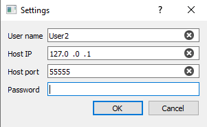
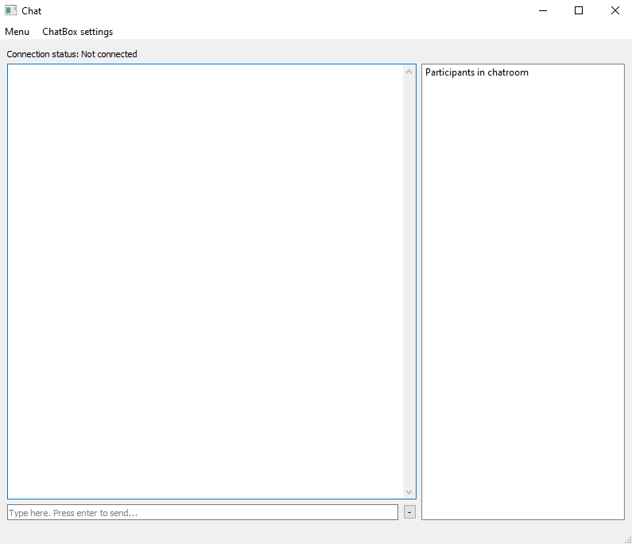
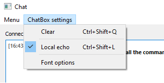
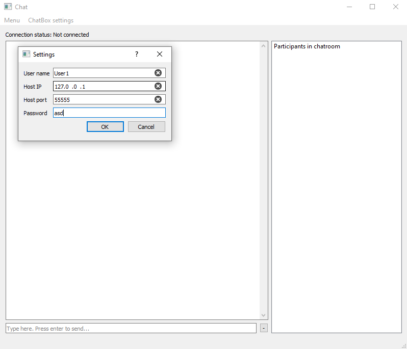
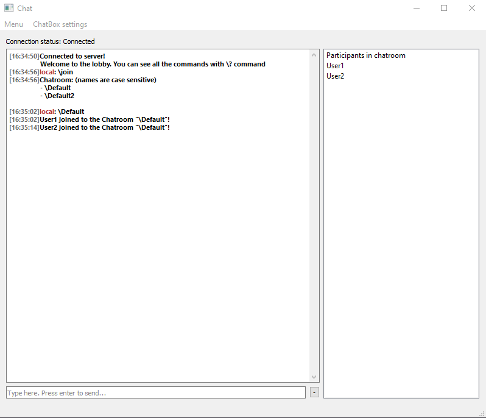
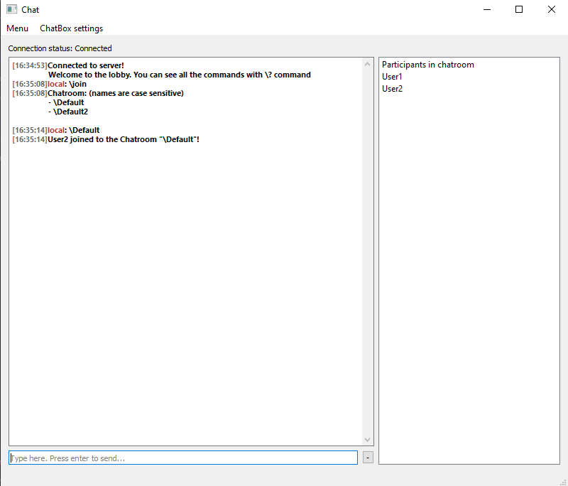
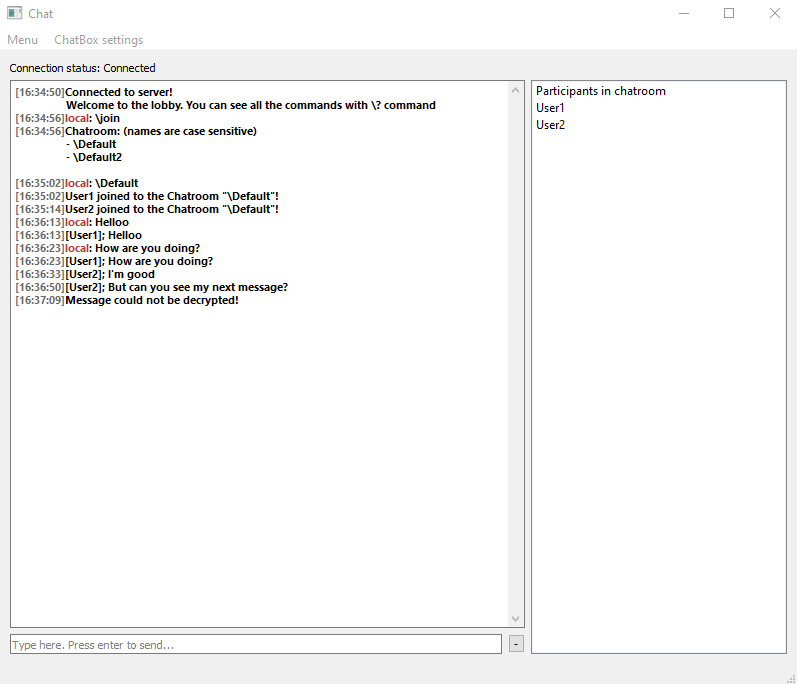
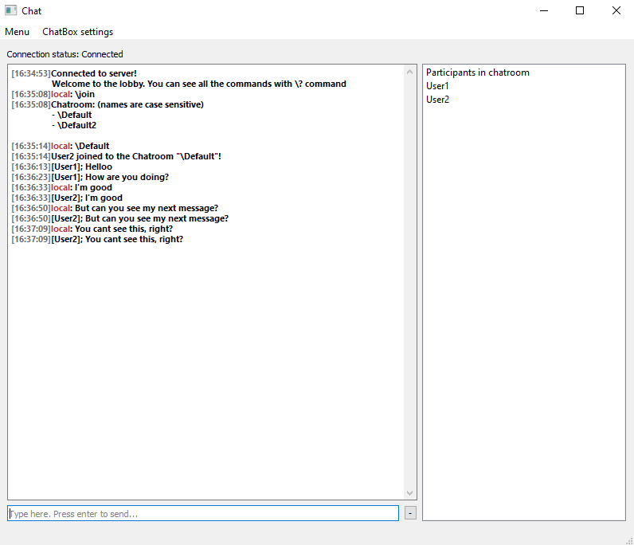

## NOTES

Markdown language [cheatsheet](https://www.markdownguide.org/cheat-sheet/)

---

## File structure, goals and requirements:

### ClientMain.py [Main client executable]
  1. Interface.py
     1. ClientSideUser.py  (Connects to server and gets ChatRoom list)
     2. UI_files (contains all UI files for the client sw)
  2. Setup
     1. host_settings.dat (contains various setting for the user. Loaded when client sw is launched)

### ServerMain.py [Main server executable]
  1. Interface.py
     1. ChatServer.py (Connects a person to Chatroom that is requested)
        1. ChatRooms.py (Broadcast messages to connected persons)
        2. ServerSideUser.py (Created on client connection to the server)
        3. UserLogin.py (Handles creation / login of accounts) <- might implement later.
  
### Project Goals:
- [x] Send message from client to server.
- [x] Send message from server to client.
- [x] Send message from client to client through server.
- [x] Send message to server and then from there to chatroom.
- [x] Encrypt the messages that are sent to chatroom, so that only client with password can decode the encryption.
- [ ] Login system so server can give privileges to users, such as, Chatroom creating and other admin commands.

### Final Version Requirements:
- Server contains chatroom admins can create.
  - Admin is privilege given to a client.
  - Only Uber Admin can give admin rights to users.
- Client has to log in to server when making connection to the server.
- Server does not hold readable data only encrypted.

---

## The Code

### Synopsis
The ChatRoom function is to send encrypted messages from client to client while the server doesn't know the content of the message. I made this project as to try my skills with bigger project.
Current code definitely still contains bugs, but my aim is to make it as bug free as I can.

CrashLog.log is created from all unexpected event in the code.

### Server
The server handles creation of the new chatroom and broadcasting all messages to the clients connected to the chatroom.

**All server side commands that can be given:**

    ?           - "Displays all commands"
	start       - "Starts the server"
	stop        - "Stops the server"
	clients     - "Shows all connected clients"
	kick        - "Kick client from the server"  <-- Currently no blacklist for the kicked clients
	new room    - "Creates new chatroom to server"
	remove room - "Removes chatroom from server"
	listen room - "Listen the chatroom in the server"  <-- mainly used for debugging since the trafic is encrypted anyways
	stop listen - "Stops listening rooms"
	close       - "Closes application"
	exit        - "Closes application"

**This is how server can see connected clients:**

***NOTE:*** _If client chatroom shows empty it means that the user is in lobby and not connected to any chatroom._

    Connected clients:
	    Name: User2, From: ('127.0.0.1', 61647), When: 2022-10-07 16:43:41.827578, Chatroom: , Status: True, client ID: 18876690483203368147884749088202190446

### Client
Client side code handles the communication to the server. It's only function is to encrypt the message and send it to chatroom to be broadcast by the server.
No client data is collected by the server to long term memory, as soon as the client leaves the server it discards the data.

Local echo in the ChatBox settings menu is used to Echo client message back to them if wanted.

Some client data is stored locally to make users life little easier, this data can be found from Setup\host_settings.dat

    [Nick]=User2
    [Font-family]=Segoe UI
    [Font-size]=12
    [Font-color]=#000000
    [IP]=127.0.0.1
    [Port]=55555

**User settings interface**

**Client ChatWindow**

**ChatBox Settings menu**

### Messaging preview

